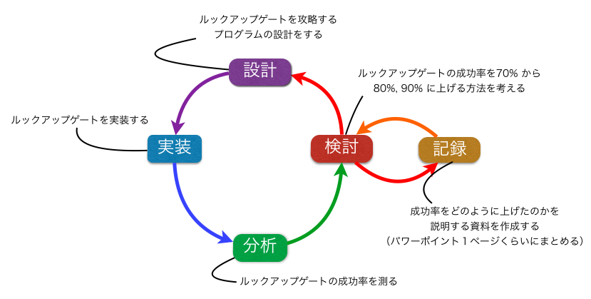

ETR2016
---

### Environment

  - leJOS/EV3 0.9.1
  - java 8
  - Ecripce Luna

  構築方法, 及びサンプルコード : http://etrobocon.github.io/etroboEV3/

### コーディング規約をコマンドでチェックする方法

```sh
$ java -jar ./etc/checkstyle-6.18-all.jar -c ./etc/google_checks.xml hoge.java
```

### 作業フロー



### KPT


